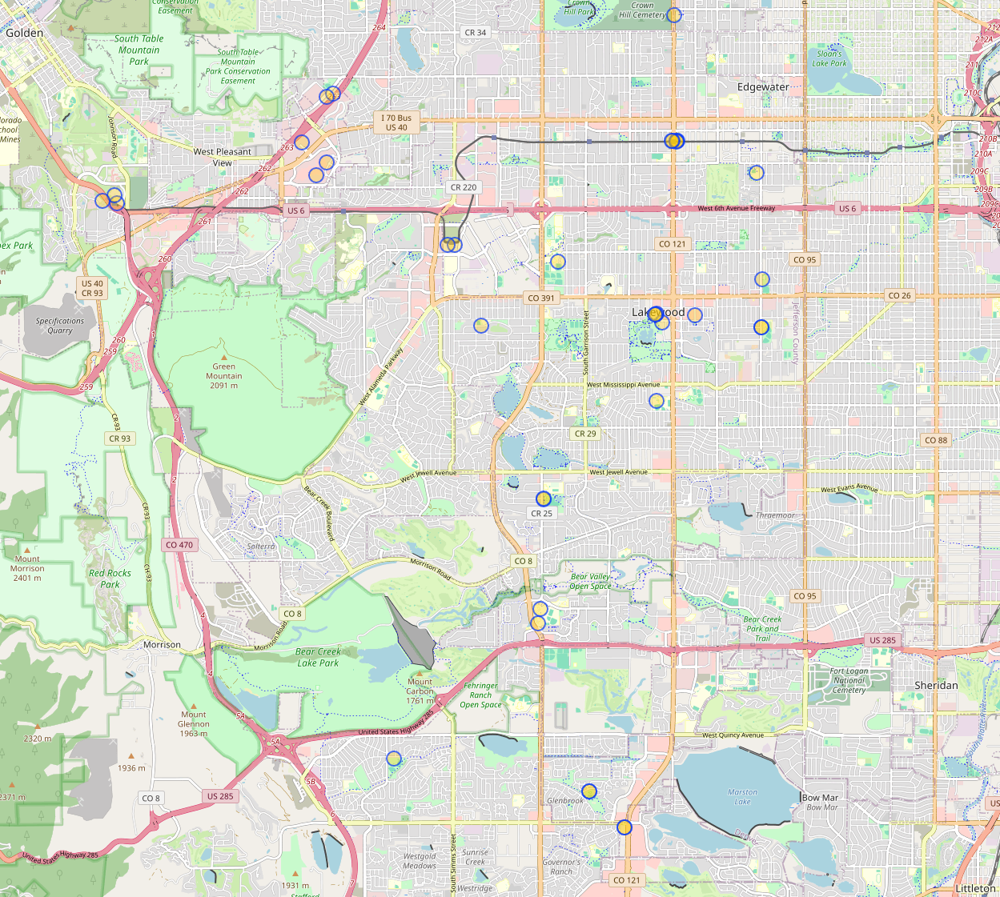
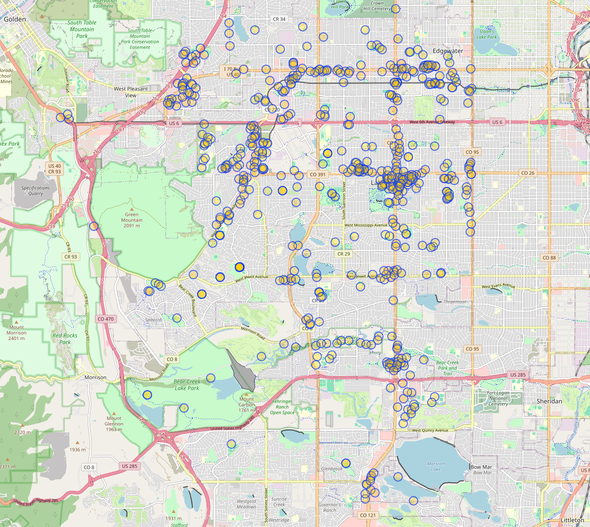
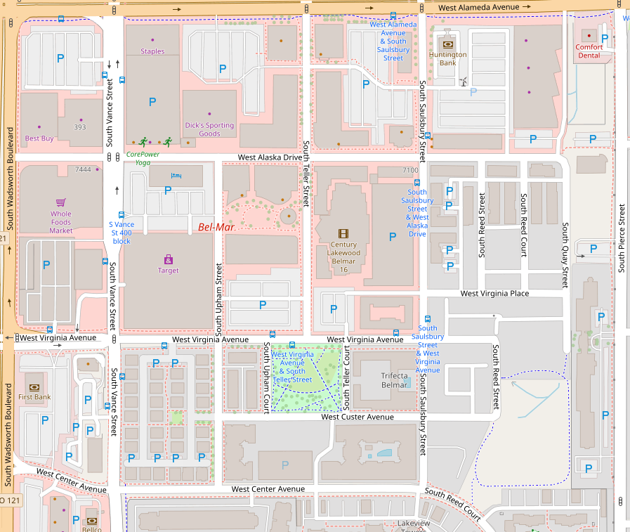
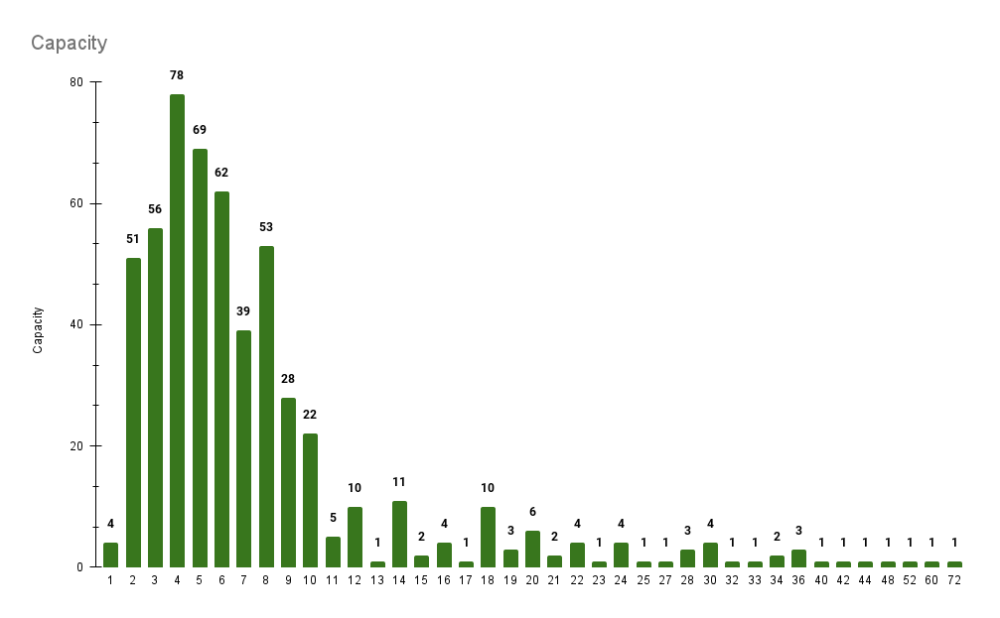

# 🚲 Bike Parking to OSM

A 2024 Bike Parking Task Force data importer.

# Before and After
| Place | Before | After |
|---|---|---|
| Denver Metro |  |  |
| Lakewood |  |  |
| Belmar |  | (Hasn't updated yet) |

# Raw Data analysis

| Info | Chart |
|---|---|
| Capacity |  |
| Type |  |
| Within plain sight |  |
| Within view of entrance |  |

# Thanks

Thanks to all of the map contributors in Lakewood. Everyone went out of their way and spent a large amount of time searching for bike parking locations all around the city. Special thanks to [Jenny Gritton](https://www.lakewoodtogether.org/bikeplanupdate/widgets/80704/team_members) for organizing and setting this up!

  Made with ❤️ by  <a href="https://github.com/SirArkimedes">SirArkimedes</a>.

